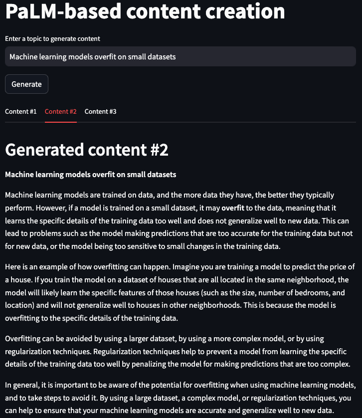

# PaLM-based content creation
Create short text content with PaLM API and Streamlit.

---
Check out the article I wrote to go along with this repository ["Content creation using MakerSuite and PaLM API"](https://dimitreoliveira.medium.com/content-creation-using-makersuite-and-palm-api-3dfc3a924510)
---

## Sample output from the app



# Requirements
- [Docker](https://docs.docker.com)
- PaLM API support. The code expects that your location is supported by the PaLM API ([check here](https://developers.generativeai.google/available_regions)), it is also expected that you have a working PaLM API key in the `.env` file at the project root.

# Usage

This app supports both Docker and Python execution, Docker is the recommended one, and you can use the commands below to use the features. If you would like to use the Python environment execution, please take a look at the `Makefile` and `Dockerfile` files and reproduce those commands.

## Prompt & context

LLMs generate text guided by prompts provided to them, usually, for sophisticated outputs, we also provide some context as part of the prompt. In this case, our prompt context guides the model to generate short content. You can find that context at the `app.py` defined by the `CONTEXT` variable, this is the default one:
```
Explain the topic of "{}" in a short text format that is targeted at the general public.\n
The tone of the text should be informative and easy to understand with some examples.
```
Feel free to experiment with it as you like.

## Configs

```
model: "models/text-bison-001"
temperature: 0.5
candidate_count: 3
top_k: 40
top_p: 0.95
max_output_tokens: 1024
stop_sequences: []
safety_settings: [
    {"category": "HARM_CATEGORY_DEROGATORY", "threshold": 4},
    {"category": "HARM_CATEGORY_TOXICITY", "threshold": 4},
    {"category": "HARM_CATEGORY_VIOLENCE", "threshold": 4},
    {"category": "HARM_CATEGORY_SEXUAL", "threshold": 4},
    {"category": "HARM_CATEGORY_MEDICAL", "threshold": 4},
    {"category": "HARM_CATEGORY_DANGEROUS", "threshold": 4},
]
```

- model: Model queried by the PaLM API.
- candidate_count: Number of outputs generated, if you change this, you might need to update the UI at the `app.py` file.
- max_output_tokens: Max number of output tokens generated by the LLM.
- stop_sequences: If provided, the model will stop generating text after this value.
- safety_settings: Various parameters to configure safety restrictions on the outputs.
- temperature, top_k and top_p: Control the LLM's behavior, there is a [good explanation for them here](https://developers.generativeai.google/guide/prompt_best_practices#experiment-with-different-parameter-values).

## Commands

Build Docker image
```bash
make build
```

Start Streamlit app
```bash
make app
```

Run code linter and formatter
```bash
make lint
```

# Resources
- [MakerSuite](https://makersuite.google.com)
- [MakerSuite - Guide](https://developers.generativeai.google/guide)
- [MakerSuite expansion announcement](https://developers.googleblog.com/2023/08/makersuite-expands-adds-new-features-for-ai-makers.html)
- [Streamlit](https://streamlit.io/)
